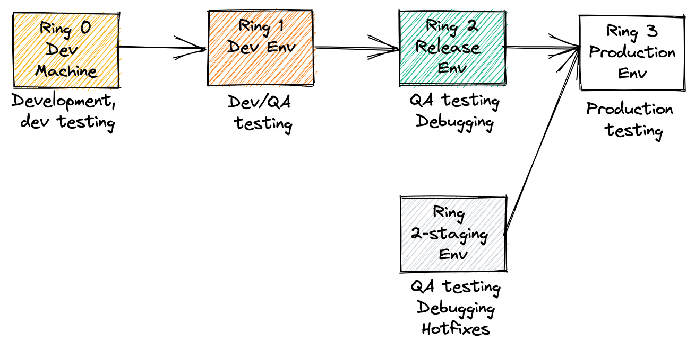

# LiquidX Developers Handbook
This guide describes the software engineering process at LiquidX.

# How should you use this handbook?
The process described here is largely driven by the strategy described in our [Engineering excellence strategy](./EngineeringExcellenceStrategy.md).
All engineers at LiquidX studio are *required* to follow the instructions included in this handbook.  __Any__ deviation from this engineering process requires *prior* approval from the head of engineering.

# 0. Before you code
Before the coding starts for a new product or feature, do the following:
1. Read the product requirements file and review the UI changes (if any)
2. Read and review the developer design document [design doc template](https://docs.google.com/document/d/1SV8qV3bE6zBeEbqtZ22irpXrOC6RLqWXy58AASRK9VY/edit?usp=sharing)
3. Create appropriate tracking work items on the task board with the work estimates

# 1. Single source of truth
We follow the Trunk-Based development model for version control and have a single source of truth for all software components and modules.  

## Key concepts
- Developers collaborate on the Trunk or the main branch
  - Use feature toggle by [Unleash](https://www.getunleash.io/) to gate your changes so that you never break the build or cause regressions.
- Release branches are created from the main branch
- Release branches are tagged with *major.minor.patch* version number `(000.000.000)`
  - Major version is incremented for new features or breaking changes
  - Minor version number is incremented for feature updates
  - Patch version numbers are incremented *only* for hotfix/patch
- After QA verification, the release branch is deployed into the production
  - Release branches are long-lived - we may use that to do root-cause analysis for incidents

# 2. Source code repository
All changes that are deployed in the production (e.g., aws lambda scripts, SQL queries to create table/schema) is stored in our code repositories:
- [LiquidX studio](https://github.com/LiquidX-Studio)
- [Anime Metaverse](https://github.com/anime-metaverse)
- [Pixelmon](https://github.com/Pixelation-Labs)

# 3. Making a change
When you make any changes, you are required to ensure the quality of your changes using the following steps __before__ you raise a pull request and the code review process. 

## Step 3.1: Static analysis
- Typescript/ Javascript - [eslint](https://eslint.org/docs/latest/user-guide/command-line-interface)
- Python [Pyflakes](https://pypi.org/project/pyflakes/)
- Solidity [slither](https://github.com/crytic/slither)

## Step 3.2: Unit test coverage
If you are writing backend code (e.g., APIs, web services), your code should have unit test coverage of $> 90%$.  For smart contracts, the unit test coverage should be 100%.

Your change should not break the existing unit tests.  Changes with the broken unit tests will be blocked from getting deployed in the production.

## Step 3.3: Dev testing
You are responsible for testing the code/feature locally and or in the dev environment.

# 4. Create Pull requests
When you have completed static analysis, unit testing, and dev testing, create a pull request on the main branch.

> Never check in code that will break existing features - use feature flighting!

## Code review
All code checkins require *at least 2* sign-offs from the reviewers before they can be merged into the `main` branch.

# 5. Deployment
## Release branch creation
The devops team will continually create release branches from the main and deploy it to the Release environment.

## Deployment rings 
All code changes will progress along the deployment path to be deployed into production:
0. Ring 0 - developer's computer
1. Ring 1 - Dev environment
2. Ring 2 - Release environment
3. Ring (Staging) - Staging environment used only for testing Hotfixes
4. Ring 3 - Production environment

# 6. Continuous Integration (CI) and Continuous Delivery (CD)
Our repositories are integrated with the build and deployment pipelines of the [CircleCI](https://circleci.com/) app.

## CI
When a pull request is merged to the main, it triggers the build in our CI/CD tool.  The build will fail if even a single unit test fails.

## CD
- When your pull request is merged to the main, it automatically is deployed in the dev environment
- DevOps team will continually create release branches from the main branch

# 7. Production Deployment

## Canary release
The risk of deploying new feature or code is minimized by using a [canary release](https://martinfowler.com/bliki/CanaryRelease.html) approach
- Each change is gated by a feature flag and is initially released to a small subset of users
- In case of a regression or major issue, the feature is toggled off and the user experience remains intact
- The feature is made available to everyone once it has been tested in production

# Hotfixes and patching
Only in case of a __critical__ or __major incident__ ([see SLA definition](./EngineeringExcellenceStrategy.md)) we will patch our production deployment.

- Hotfix/patching requires prior approval of the head of engineering 
- Our devops team will create a staging branch from production
- Developers will make changes to that staging branch using a pull request
- The staging branch is deployed in the staging environment for our QA team to test
- Once the dev testing is completed and the QA verification is completed, the change is deployed to the production
- QA team will verify the change in production to ensure there are no regressions
- Finally, the hotfix changes are integrated in the main branch following the regular code review/testing process

# References
- [Trunk-based development](https://trunkbaseddevelopment.com/continuous-integration/)
- [Software development with feature toggles: practices used by practitioners](https://arxiv.org/pdf/1907.06157.pdf) 